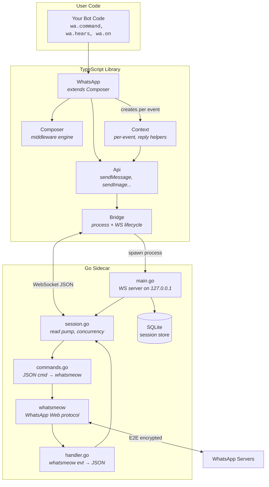
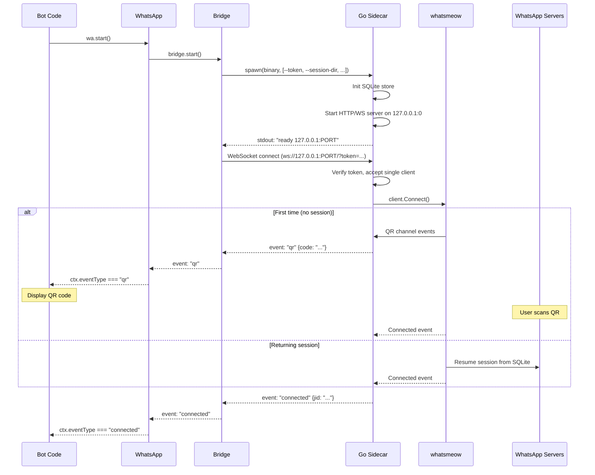
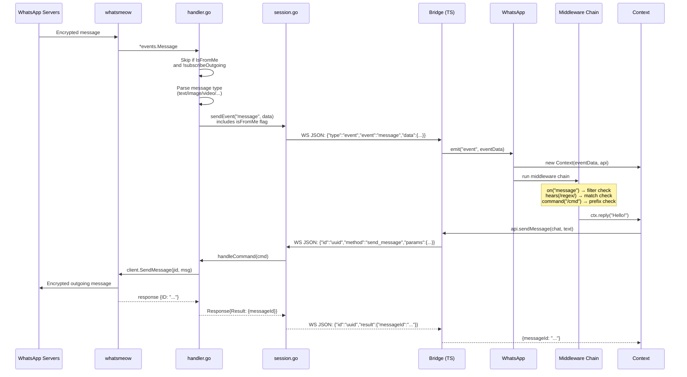
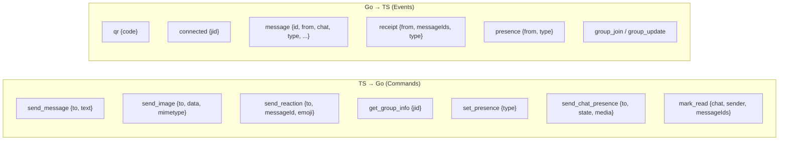
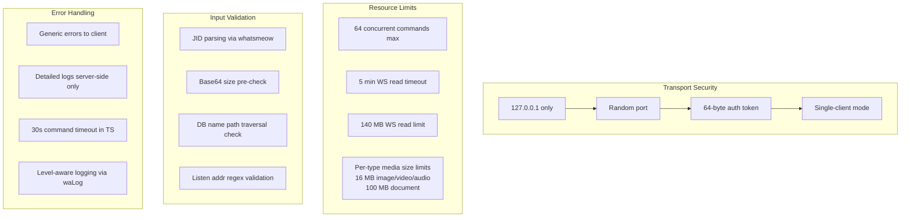

# Architecture

## High-Level Overview



## Startup Flow



## Message Flow (Incoming)



## Middleware Engine

```mermaid
graph LR
    Event([Incoming Event]) --> MW1

    subgraph Onion Model
        MW1[use&#40;logger&#41;] -->|next&#40;&#41;| MW2[on&#40;'message'&#41;]
        MW2 -->|next&#40;&#41;| MW3[hears&#40;/hi/&#41;]
        MW3 -->|next&#40;&#41;| MW4[command&#40;'help'&#41;]
        MW4 -->|next&#40;&#41;| END[fallback]
    end

    MW3 -.->|match!| Reply([ctx.reply])
```



The middleware follows an **onion model** (like Koa/grammY):
- Each middleware calls `next()` to pass control to the next one
- Filters (`on`, `hears`, `command`) skip to `next()` if they don't match
- When a filter matches, it runs its handlers and stops the chain

## WebSocket Protocol



### Command format
```json
{"id": "uuid", "method": "send_message", "params": {"to": "jid@s.whatsapp.net", "text": "hello"}}
```

### Response format
```json
{"id": "uuid", "result": {"messageId": "ABC123"}}
```

### Event format
```json
{"type": "event", "event": "message", "data": {"id": "...", "from": "...", "text": "...", "isFromMe": false}}
```

## Security Model


