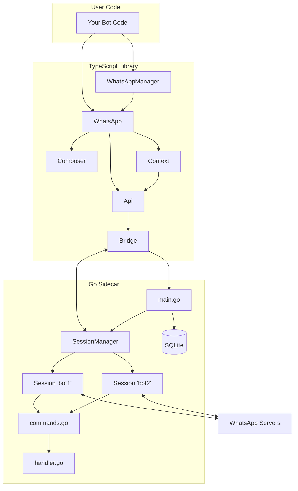
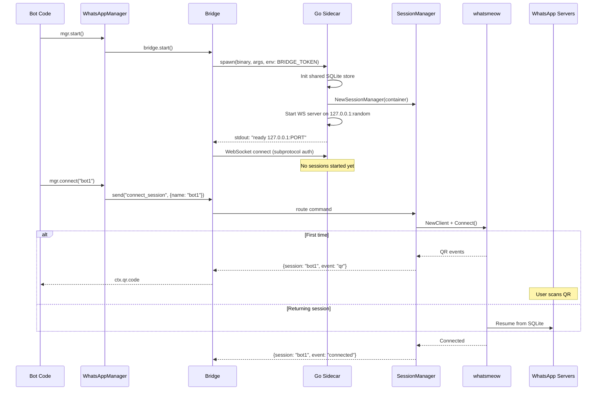
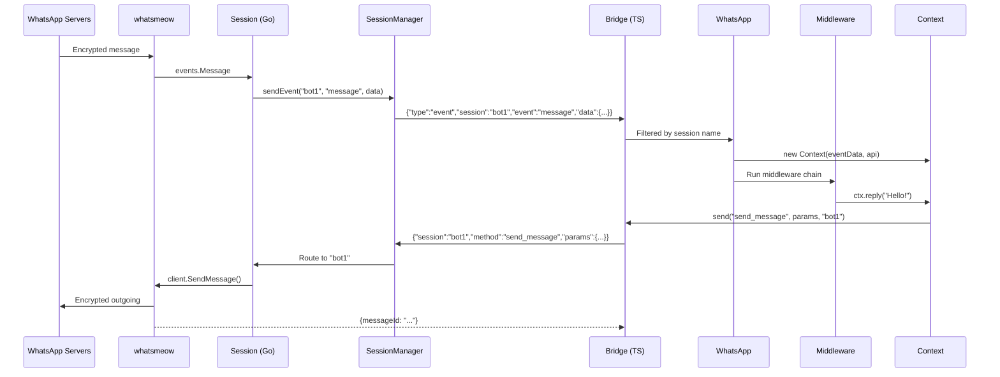
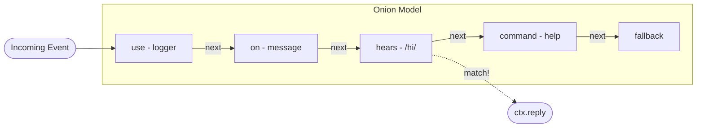

# Architecture

whatspurr is a TypeScript library backed by a Go sidecar. The TypeScript layer provides the developer-facing API (middleware, composers, context objects), while the Go sidecar runs the WhatsApp protocol via [whatsmeow](https://github.com/tulir/whatsmeow). They communicate over a WebSocket on localhost.

## High-Level Overview



### Components

| Component | Role |
|---|---|
| **WhatsAppManager** | Multi-session orchestrator. Owns one `Bridge`, creates `WhatsApp` instances on demand. |
| **WhatsApp** | Per-session entry point. Extends `Composer` with middleware, filters, and event handling. |
| **Composer** | grammY-style middleware engine (onion model). |
| **Context** | Per-event object with reply helpers, message accessors, and API shortcuts. |
| **Api** | Direct API methods (`sendMessage`, `sendImage`, etc.). Session-aware. |
| **Bridge** | Manages the Go process lifecycle and WebSocket connection. |
| **SessionManager** | Go-side manager. Routes commands/events by session name. |
| **Session** | Go-side per-session wrapper around a `whatsmeow.Client` goroutine. |

## Startup Flow



## Message Flow



## Middleware Engine



- Each middleware calls `next()` to pass to the next one
- Filters (`on`, `hears`, `command`) skip to `next()` if they don't match
- When a filter matches, it runs its handlers and stops the chain
- Each `WhatsApp` instance has its own independent middleware stack

## WebSocket Protocol

All commands and events are multiplexed over a single WebSocket. The `session` field routes to the correct whatsmeow client.

### Commands (TS to Go)

```json
{"id": "uuid", "session": "bot1", "method": "send_message", "params": {"to": "jid", "text": "hi"}}
```

**Session management:**
- `connect_session` — start a session goroutine
- `disconnect_session` — stop goroutine, keep auth
- `destroy_session` — logout + delete from DB
- `list_sessions` — list all devices in DB

**Per-session:**
- `send_message`, `send_image`, `send_video`, `send_audio`, `send_document`
- `send_reaction`, `download_media`, `get_group_info`
- `send_chat_presence`, `mark_read`, `set_presence`

### Events (Go to TS)

```json
{"type": "event", "session": "bot1", "event": "message", "data": {...}}
```

Events: `qr`, `connected`, `disconnected`, `message`, `message_reaction`, `receipt`, `presence`, `group_join`, `group_update`

### Responses

```json
{"id": "uuid", "result": {"messageId": "ABC123"}}
```

```json
{"id": "uuid", "error": {"code": 1003, "message": "missing 'text' parameter"}}
```

## Security

- **Localhost only** — WS server binds to `127.0.0.1`, never exposed to the network
- **Random port** — OS assigns an ephemeral port, communicated via stdout
- **Auth token** — 32-byte random token passed via `BRIDGE_TOKEN` env var (not a CLI flag); authenticated via `Sec-WebSocket-Protocol` subprotocol header, verified with constant-time compare
- **Single WS connection** — only one client can connect at a time
- **Bounded concurrency** — max 64 concurrent command handlers
- **Size limits** — 135 MB WS read limit, per-type media caps (16 MB images, 100 MB documents)
- **Input validation** — JID parsing, base64 pre-checks, DB name path traversal prevention, `download_media` path confined to configured download directory
- **Opaque errors** — generic errors to the client, detailed logs server-side only
