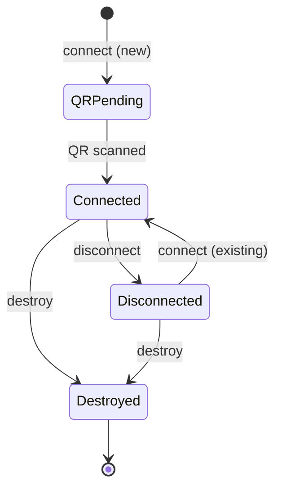

# Multi-Session

Run multiple WhatsApp accounts from a single process. All sessions share one Go bridge process and one SQLite database. Sessions are spun up on demand as goroutines and can be connected/disconnected without losing auth data.

## Quick Start

```ts
import { WhatsAppManager } from "@arnabxd/whatspurr";

const mgr = new WhatsAppManager({ sessionDir: "./session" });
await mgr.start();

const bot = await mgr.connect("support-bot");
bot.on("message:text", async (ctx) => {
  await ctx.reply("Got it!");
});
await bot.start(); // registers handlers first, then connects
```

`mgr.connect()` returns a `WhatsApp` instance **without** connecting yet. Register your handlers, then call `wa.start()` to connect. This ensures no events (like QR codes) are missed.

## Use Cases

### Long-lived listener

Keep a session connected to receive messages and react in real time.

```ts
const bot = await mgr.connect("listener");

bot.on("qr", (ctx) => {
  console.log("Scan QR:", ctx.qr.code);
});

bot.on("message:text", async (ctx) => {
  console.log(`${ctx.from}: ${ctx.text}`);
  await ctx.reply(`Echo: ${ctx.text}`);
});

await bot.start(); // connects after handlers are set
// stays connected indefinitely...
```

### Fire-and-forget sender

Connect a session, send messages, disconnect. Auth data stays in the DB so the next connect skips QR.

```ts
const sender = await mgr.connect("bulk-sender");
await sender.start();
await sender.api.sendMessage("123@s.whatsapp.net", "Hello!");
await mgr.disconnect("bulk-sender"); // goroutine stops, zero resources
```

### Mixed

Run a listener and a sender at the same time. Disconnect the sender when done.

```ts
const listener = await mgr.connect("main-account");
listener.on("message:text", handleMessage);
await listener.start();

const sender = await mgr.connect("bulk-sender");
await sender.start();
await sender.api.sendMessage(jid, text);
await mgr.disconnect("bulk-sender");
// listener keeps running
```

## Session Lifecycle



| Method | What happens | Auth data | Can reconnect? |
|---|---|---|---|
| `connect(name)` | Prepares a WhatsApp instance with bridge listeners | - | - |
| `wa.start()` | Sends `connect_session`, starts whatsmeow goroutine | Preserved | - |
| `disconnect(name)` | Disconnects from WhatsApp, stops goroutine | Preserved | Yes (skip QR) |
| `destroy(name)` | Logout from WhatsApp, delete device from DB | Deleted | No (needs re-QR) |

## API

### `WhatsAppManager`

```ts
const mgr = new WhatsAppManager(config);
```

Takes the same [`WhatsAppConfig`](./configuration) as `WhatsApp`.

#### `mgr.start()`

Starts the Go bridge process. No sessions are connected yet.

#### `mgr.connect(name): Promise<WhatsApp>`

Prepare a session by name. Returns a `WhatsApp` instance with its own middleware stack. The session is **not connected yet** — register your event handlers, then call `wa.start()`.

- If already connected, returns the existing instance.

After calling `wa.start()`:
- If the session is new, a QR event will be emitted for scanning.
- If the session exists in the DB, it reconnects instantly (no QR).

#### `mgr.disconnect(name): Promise<void>`

Disconnect a session. The goroutine stops and the WhatsApp connection closes, but auth data remains in SQLite. Call `connect(name)` later to resume.

#### `mgr.destroy(name): Promise<void>`

Logout from WhatsApp and delete the device from the database. The session cannot be reconnected — a new QR scan is required.

#### `mgr.list(): Promise<SessionInfo[]>`

List all sessions stored in the database.

```ts
const sessions = await mgr.list();
// [{ name: "bot1", jid: "123@s.whatsapp.net", connected: true },
//  { name: "bot2", jid: "456@s.whatsapp.net", connected: false }]
```

#### `mgr.stop(): Promise<void>`

Disconnect all sessions and kill the Go bridge process.

## Backward Compatibility

The standalone `WhatsApp` class still works exactly as before. It internally creates a `"default"` session.

```ts
// This still works — no changes needed
const wa = new WhatsApp(config);
await wa.start();
```
